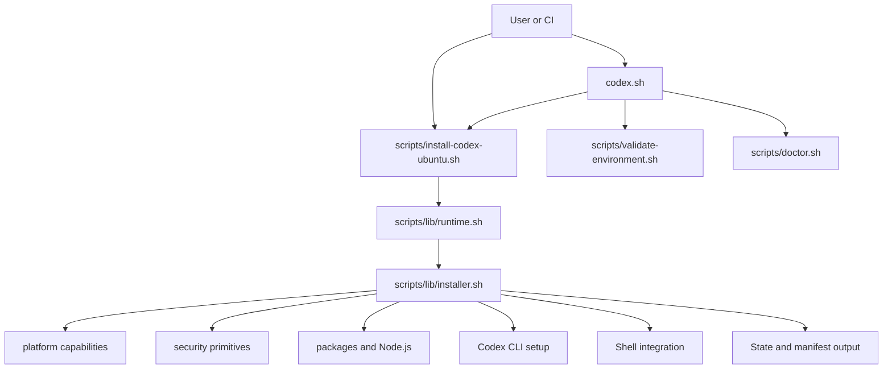
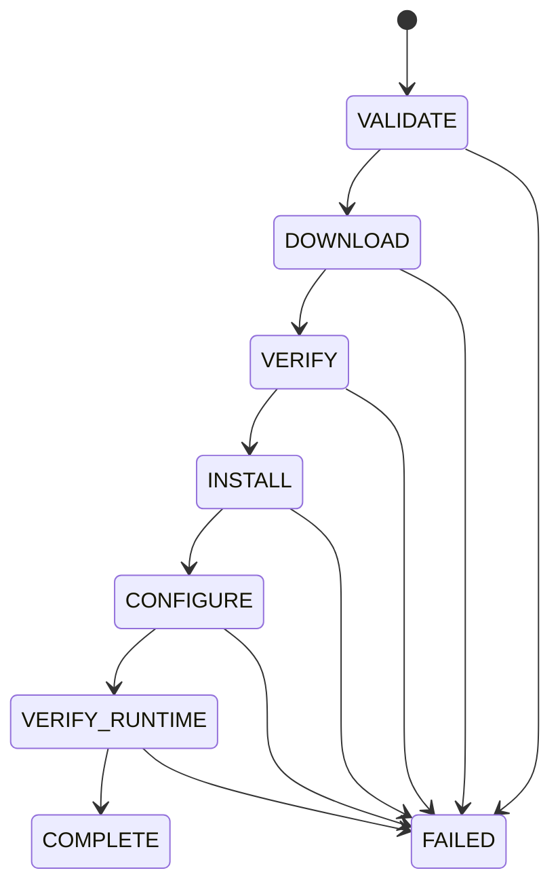

# zcodex

[](https://github.com/cvsz/zcodex/actions/workflows/ci.yml)
[](https://github.com/cvsz/zcodex/actions/workflows/e2e.yml)
[](https://github.com/cvsz/zcodex/actions/workflows/release-validate.yml)
[](https://github.com/cvsz/zcodex/actions/workflows/release.yml)
[](LICENSE)

`zcodex` is a minimal, auditable Ubuntu bootstrapper for Codex CLI environments. It installs and validates a Codex-ready runtime with small Bash libraries, explicit state transitions, rollback-aware file writes, and CI-visible release automation.

## Why zcodex exists

Codex runtime setup should be easy to inspect, safe to dry-run, and simple to recover. This repository keeps installation logic modular instead of hiding it behind a monolithic script or remote execution pipeline.

`zcodex` focuses on:

- Ubuntu-first Codex CLI bootstrap and validation.
- Deterministic install phases and machine-readable runtime manifests.
- Security-conscious download, checksum, tempfile, lockfile, and rollback primitives.
- Clear CI, release, troubleshooting, and contribution paths for open-source maintenance.

## Stabilization scope

The current release hardening pass focuses on the failure modes that usually make bootstrap repositories unsafe to operate at scale: host PATH leakage, runner-owned Node.js/npm assumptions, mutable shared state, nondeterministic archives, malformed manifests, interrupted installs, and release workflow drift. The repository is structured so each of those concerns has an explicit script, fixture, test, workflow, or document instead of relying on undocumented runner behavior.

## Quick start

Clone the repository and run the installer:

```bash
git clone https://github.com/cvsz/zcodex.git
cd zcodex
bash scripts/install-codex-ubuntu.sh
```

Recommended dry run for review or CI:

```bash
CI=true bash scripts/install-codex-ubuntu.sh --dry-run --skip-docker --skip-optional
```

Run health checks after installation:

```bash
bash scripts/doctor.sh
```

Validate the deterministic E2E scenario plan without Docker:

```bash
bash scripts/e2e-runner.sh --dry-run --ubuntu 24.04 --arch amd64
```

## Supported platforms

Primary support targets:

- Ubuntu 22.04 LTS
- Ubuntu 24.04 LTS
- `x86_64`/`amd64`
- `aarch64`/`arm64`

Runtime awareness:

- Native Ubuntu hosts.
- WSL environments.
- Common container runtimes.
- Optional Docker availability.

Other environments are best-effort only. The installer detects capabilities such as APT, systemd, Docker, and rootless behavior before deciding what it can safely do.

## Installation options

Common installer commands:

```bash
bash scripts/install-codex-ubuntu.sh
bash scripts/install-codex-ubuntu.sh --skip-optional
bash scripts/install-codex-ubuntu.sh --dry-run --skip-docker --skip-optional
CI=true bash scripts/install-codex-ubuntu.sh --ci --skip-docker
```

Unified release orchestrator commands:

```bash
./codex.sh basic --dry-run --skip-docker
./codex.sh full --skip-optional
./codex.sh ultimate --skip-docker
./codex.sh orchestrator --offline --repair
./codex.sh release --skip-optional
```

`codex.sh` is the master entry point for installer and release workflows. It validates the local environment, records each step to a combined operational log, and dispatches to the correct installer or validation path for the selected mode.

| Mode | Workflow |
| --- | --- |
| `basic` | Runs `scripts/install-codex-ubuntu.sh` with any extra installer arguments. |
| `full` | Runs the installer, then performs an offline doctor check. |
| `ultimate` | Runs environment validation, the installer, and an online doctor check. |
| `orchestrator` | Runs `scripts/doctor.sh` with any extra doctor arguments. |
| `release` | Runs the installer and final doctor validation for release readiness. |

The orchestrator checks for `bash`, warns when optional cluster or runtime tools such as `kubectl`, Docker, or Node.js are unavailable, and leaves fatal dependency decisions to the selected installer or doctor mode. It writes to `codex_release.log` by default, honors `ZCODEX_RELEASE_LOG` or `LOG_FILE` when set, and falls back to `${TMPDIR:-/tmp}/zcodex/codex_release.log` if the requested log path is not writable.

## Architecture





Repository layout:

```text
zcodex/
├── .github/workflows/       # CI, security, formatting, release workflows
├── docs/                    # Architecture, release, audit, troubleshooting, branding
├── scripts/                 # Installer, doctor, release, validation entry points
│   └── lib/                 # Shared Bash runtime libraries
├── tests/                   # Bats and shellcheck test entry points
├── CHANGELOG.md             # User-facing release history
├── CONTRIBUTING.md          # Contribution and validation guide
├── LICENSE                  # MIT license terms
├── ROADMAP.md               # Maintainer roadmap and non-goals
└── SECURITY.md              # Private vulnerability reporting policy
```

Deeper architecture notes are available in [`docs/architecture.md`](docs/architecture.md), [`docs/runtime.md`](docs/runtime.md), [`docs/capabilities.md`](docs/capabilities.md), [`docs/manifest-state.md`](docs/manifest-state.md), and [`docs/infrastructure-hardening.md`](docs/infrastructure-hardening.md).

## Security model

`zcodex` does not use `curl | bash` installation patterns. Security-sensitive behavior is centralized in dedicated helpers and documented for review.

The installer uses:

- HTTPS-only download helpers with strict curl flags.
- Optional SHA-256 verification for direct downloads and checksum manifests.
- `mktemp -d` workspaces with trap-based cleanup.
- `flock` protection against concurrent installer runs.
- Timestamped rollback backups under `${HOME}/.zcodex/backups/`.
- Private state and manifest directories under `${HOME}/.local/share/zcodex/`.
- Minimal Codex config generation without storing secrets.

Report vulnerabilities privately using [`SECURITY.md`](SECURITY.md).

## Installer config

A valid example installer configuration is available at [`config/zcodex/config.toml`](config/zcodex/config.toml). Copy it to `${HOME}/.config/zcodex/config.toml` when you want a local, operator-editable config file. Shell snippets or custom orchestration notes must remain inside TOML strings, such as `[custom_instructions].shell`; appending raw shell after the TOML document makes the config invalid.

## Codex config

The generated Codex config intentionally stays minimal:

```toml
model = "codex-1"

approval-policy = "on-request"
sandbox-mode = "workspace-write"
```

## CI and quality gates

The repository exposes CI status through README badges and GitHub Actions workflows:

| Workflow | Purpose |
| --- | --- |
| `ci` | Bash syntax, ShellCheck, shfmt, Bats, workflow policy, E2E plan validation, release reproducibility, and security audit jobs. |
| `e2e` | Containerized Ubuntu 22.04/24.04 validation across amd64 and arm64 scenarios. |
| `release-validate` | VERSION, tag, changelog, orchestrator dry-run, and deterministic artifact validation. |
| `release` | Tag-only deterministic archive build, reproducibility gate, checksum verification, artifact upload, and GitHub Release publication. |

Local validation:

```bash
make lint
make fmt-check
make test
make doctor
make validate
```

Equivalent direct checks:

```bash
bash -n codex.sh scripts/*.sh scripts/lib/*.sh tests/*.sh tests/helpers/*.bash
{ printf '%s\0' codex.sh; find scripts tests -type f \( -name '*.sh' -o -name '*.bash' \) -print0; } | LC_ALL=C sort -z | xargs -0 shellcheck
shfmt -d codex.sh scripts tests
bats tests
```

## Releases

`zcodex` uses semantic versioning and publishes release artifacts from Git tags.

Release contract:

- `VERSION` is the version source of truth.
- Tags use `vX.Y.Z`.
- `CHANGELOG.md` contains a matching `## vX.Y.Z` section.
- Release notes are extracted from the changelog.
- Release artifacts include `zcodex-vX.Y.Z.tar.gz`, `SHA256SUMS`, and signing instructions.

Create a release by tagging the committed tree:

```bash
git tag v0.1.0
git push origin v0.1.0
```

Local release dry run:

```bash
make release
make release-checksum
```

See [`docs/release.md`](docs/release.md), [`docs/release-checklist.md`](docs/release-checklist.md), and [`docs/release-notes-template.md`](docs/release-notes-template.md).

## Troubleshooting

Start with doctor mode:

```bash
bash scripts/doctor.sh
```

For airgapped, proxied, or local-only validation:

```bash
bash scripts/doctor.sh --offline
bash scripts/doctor.sh --repair
```

Common checks:

- Confirm the host is Ubuntu 22.04 or 24.04 when using the full installer.
- Confirm the architecture is `amd64`/`x86_64` or `arm64`/`aarch64`.
- Confirm `sudo`, APT, `curl`, and `git` are available for install operations.
- If Docker group membership was changed, log out and back in.
- If `codex` is unavailable after install, confirm npm global binaries are on `PATH`.
- Review `${HOME}/.local/share/zcodex/manifest.json` and the installer phase state under `${HOME}/.local/share/zcodex/state`.

Detailed troubleshooting is available in [`docs/troubleshooting.md`](docs/troubleshooting.md).

## Rollback strategy

Before rewriting an existing Codex config or appending to an existing shell profile, the installer copies the original file into `${HOME}/.zcodex/backups/<timestamp>/` while preserving the source path under that backup root.

Restore a file by copying the saved version back to its original location, then rerun:

```bash
bash scripts/doctor.sh
```

Manifest and state design details are available in [`docs/manifest-state.md`](docs/manifest-state.md).

## Open-source readiness

Project governance and presentation documents:

- [`CONTRIBUTING.md`](CONTRIBUTING.md) for local setup, style, testing, and PR expectations.
- [`SECURITY.md`](SECURITY.md) for private vulnerability reporting.
- [`ROADMAP.md`](ROADMAP.md) for maintainer priorities and non-goals.
- [`CHANGELOG.md`](CHANGELOG.md) for release history.
- [`docs/repo-audit.md`](docs/repo-audit.md) for repository standards and DevEx audit notes.
- [`docs/github-presentation.md`](docs/github-presentation.md) for topics, description, social preview, and release notes strategy.
- [`assets/social-preview.svg`](assets/social-preview.svg) as the source artwork for the GitHub social preview.

## License verification

`zcodex` is released under the MIT License. Verify the license before redistributing or packaging:

```bash
test -f LICENSE
sed -n '1,25p' LICENSE
```

The root [`LICENSE`](LICENSE) file is the canonical license text.
