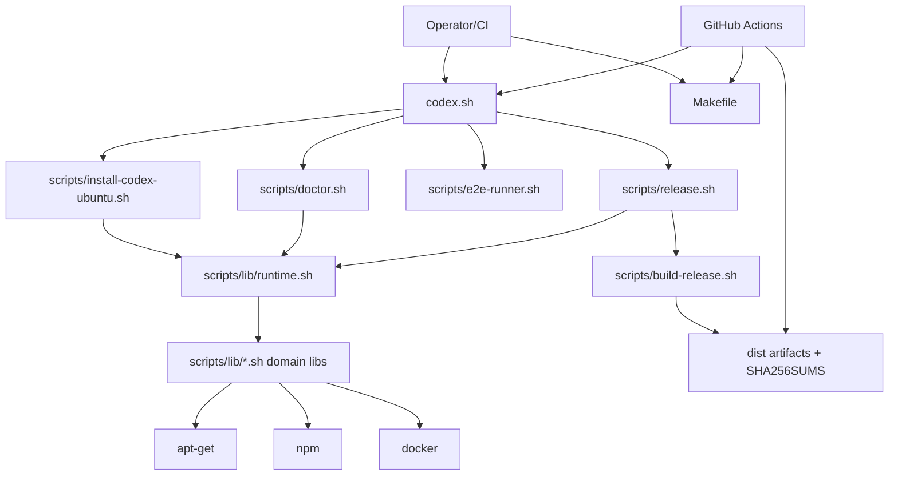

# Maximum-Depth Repository Reconnaissance
Date: 2026-05-09
Repo: `cvsz/zcodex`

## 1. Findings

### Detected languages
- Bash/Shell (primary implementation and orchestration): `codex.sh`, `scripts/**/*.sh`, `tests/**/*.sh`, `tests/**/*.bash`.
- Python (workflow policy validator): `tests/workflow_policy.py`.
- Markdown (docs and operational reports): `docs/**/*.md`, root `*.md`.
- YAML (GitHub Actions): `.github/workflows/*.yml`.
- TOML (runtime config): `config/zcodex/config.toml`.
- SVG (asset): `assets/social-preview.svg`.

### Detected frameworks/tooling ecosystems
- Bash modular library pattern (`scripts/lib/*.sh`) loaded by `scripts/lib/runtime.sh`.
- Test frameworks: `bats` + shellcheck + shfmt via `Makefile` targets.
- CI framework: GitHub Actions workflow suite.

### Monorepo structure
- Not a monorepo. Single product repo with one deployable/runtime behavior set and one shared script library tree.

### Package managers
- System packages: `apt-get` (Ubuntu centric).
- JS runtime packaging: `npm` global install/uninstall paths used by installer/maintenance.
- No Poetry/pip/cargo/go modules detected.

### Services and operational entrypoints
- Installer service: `scripts/install-codex-ubuntu.sh`.
- Doctor/repair service: `scripts/doctor.sh`, `scripts/doctor-ci.sh`.
- Diagnostics service: `scripts/diagnostics.sh`.
- E2E scenario runner: `scripts/e2e-runner.sh`.
- Release service: `scripts/release.sh`, `scripts/build-release.sh`, `scripts/verify-release-artifacts.sh`.
- Top-level orchestrator: `codex.sh`.

### APIs
- No internal HTTP/gRPC API server detected.
- External API surfaces: Ubuntu package mirrors (apt), npm registry, GitHub API through Actions and release publishing actions.

### Worker systems
- CI jobs in GitHub Actions act as worker pools (`ci`, `e2e`, `release`, `release-validate`, `security`, `supply-chain`, `ci-self-healing`).
- No queue-backed async worker framework (e.g., Celery/RQ/Sidekiq) detected.

### Containers
- Containerized E2E execution via Docker in `scripts/e2e-runner.sh`.
- No repository Dockerfile present; runtime uses upstream Ubuntu images at execution time.

### Orchestration
- Primary orchestration: GitHub Actions workflows.
- Secondary orchestration: `Makefile` target graph and `codex.sh` mode switching.

### Infrastructure as Code (IaC)
- No Terraform/Pulumi/CloudFormation/Kubernetes manifests detected.
- Shell-driven host bootstrap and CI workflow YAML act as procedural infra automation.

### GitHub workflows
- `.github/workflows/ci.yml`
- `.github/workflows/e2e.yml`
- `.github/workflows/release-validate.yml`
- `.github/workflows/release.yml`
- `.github/workflows/security.yml`
- `.github/workflows/supply-chain.yml`
- `.github/workflows/ci-self-healing.yml`

### Release pipelines
- Validation gate: `scripts/validate-release.sh`, `scripts/validate-release-tag.sh`.
- Build: deterministic tarball in `scripts/build-release.sh`.
- Integrity: checksum verification in `scripts/verify-release-artifacts.sh` and CI gates.
- Publish: `release.yml` with `softprops/action-gh-release` artifact publishing.

### Dangerous execution paths (identified)
1. Privileged command execution wrappers (`sudo`-backed package/system mutation): `scripts/lib/exec.sh`, `scripts/lib/packages.sh`, `scripts/lib/docker.sh`.
2. Network fetch and install path (`curl`, apt, npm): `scripts/lib/security.sh`, installer orchestration in `scripts/lib/installer.sh`.
3. Docker command execution with dynamic args from scenario files: `scripts/e2e-runner.sh`.
4. PATH trust and command shadowing risk windows before validation (mitigated by security checks): `scripts/lib/security.sh`, `scripts/doctor.sh`.

---

## 2. Root cause (systemic risk drivers)
- Bash-heavy control plane increases susceptibility to quoting/env/path edge-case regressions.
- Installer must bridge heterogeneous host states (nvm/asdf/system apt/NodeSource), increasing branch complexity.
- Release path is secure-minded but depends on external actions and registries.
- Multi-workflow CI matrix broadens assurance coverage while increasing maintenance and drift burden.

## 3. Impact
- Failures in shared runtime/security libraries can cascade across install, doctor, e2e, and release paths.
- PATH/privilege mistakes can become host-compromise vectors.
- Release-chain defects can produce unverifiable or non-reproducible artifacts.
- CI workflow drift can silently reduce security checks or break determinism guarantees.

## 4. Patch
- Documentation-only patch: added this max-depth reconnaissance report with architecture graphing, risk ranking, and attack-surface inventory.

## 5. Tests added
- None (no runtime behavior changed).

## 6. Validation results
- Performed static reconnaissance via source inventory and targeted pattern scans.
- No code execution changes were introduced.

## 7. Remaining risks
- Third-party GitHub Action supply-chain dependency.
- Shell semantics fragility under uncommon locale/path/permissions combinations.
- High-coupling shared libs remain single points of behavioral failure.

## 8. Recommended next actions
1. Add automated SBOM generation + artifact signing in release workflow.
2. Add stricter shell taint checks for user-provided flags/values reaching command execution paths.
3. Expand regression tests around privileged wrapper (`run_privileged`) and URL fetch validation.
4. Add threat-driven tests for path traversal, path shadowing, and malformed manifest content.

---

## Architecture Graph


## Runtime Dependency Graph
```text
Entrypoints: codex.sh, install-codex-ubuntu.sh, doctor.sh, release.sh, e2e-runner.sh
  -> runtime loader: scripts/lib/runtime.sh
    -> shared libs: logging, exec, retry, security, platform, packages, nodejs, docker, manifest, installer
      -> host/system commands: bash, sudo, apt-get, curl, git, tar, gzip, sha256sum, npm, docker
        -> external systems: Ubuntu mirrors, npm registry, GitHub Actions artifacts/releases
```

## Service Interaction Map
```text
CI workflow job -> make validate -> lint/fmt/tests/e2e-dry-run
operator -> codex.sh basic/full/ultimate -> installer phases -> host mutation
operator -> doctor -> diagnostics + remediation guidance
release workflow -> validate-release -> build-release -> verify-release-artifacts -> publish GH release
```

## Trust Boundaries
1. Unprivileged shell/session -> privileged sudo operations.
2. Local repo code -> downloaded packages/artifacts over network.
3. CI ephemeral runners -> persistent release artifacts/tags.
4. User PATH/environment -> trusted command resolution envelope.

## Attack Surface Inventory
- CLI flags and env vars in installer/doctor/release entrypoints.
- Command invocation wrappers and sudo execution guardrails.
- Network download primitives and checksum validation chain.
- Docker-based E2E command construction/execution.
- GitHub workflow scripts and third-party actions.

## Privileged Code Paths
- `scripts/lib/exec.sh` (`run_privileged` with sudo path checks).
- `scripts/lib/packages.sh` apt install/update flows.
- `scripts/lib/docker.sh` docker package install, daemon enable, group mutation.
- `scripts/lib/installer.sh` orchestration of privileged phases.

## Risky Modules Inventory
- Very high: `scripts/lib/security.sh`, `scripts/lib/exec.sh`, `scripts/lib/installer.sh`.
- High: `scripts/lib/packages.sh`, `scripts/lib/nodejs.sh`, `scripts/lib/docker.sh`, `scripts/release.sh`.
- Medium: `scripts/doctor.sh`, `scripts/e2e-runner.sh`, `tests/workflow_policy.py`.

## Technical Debt Hotspots
- Large Bash code surface and mutable global state patterns.
- Cross-cutting coupling through `runtime.sh` mega-import model.
- Fixture and scenario matrix expansion costs in `tests/runtime-fixtures`.
- High volume of operational markdown docs with potential drift.

## Ranking

### Critical modules (top)
1. `scripts/lib/installer.sh`
2. `scripts/lib/security.sh`
3. `scripts/lib/exec.sh`
4. `scripts/lib/runtime.sh`
5. `scripts/release.sh`

### Fragile components
1. Runtime ownership detection/classification logic.
2. PATH canonicalization + trust heuristics.
3. Docker optionality handling across host/container/CI contexts.
4. Deterministic release reproducibility gates.

### High-risk files
1. `scripts/lib/security.sh`
2. `scripts/lib/exec.sh`
3. `scripts/lib/packages.sh`
4. `scripts/lib/nodejs.sh`
5. `.github/workflows/release.yml`
6. `scripts/e2e-runner.sh`

### Likely failure zones
- Non-standard PATH or shell environments.
- Hosts with pre-existing Node/npm ownership conflicts.
- CI runners with transient apt/network issues.
- Tag/version/release artifact mismatch paths.
